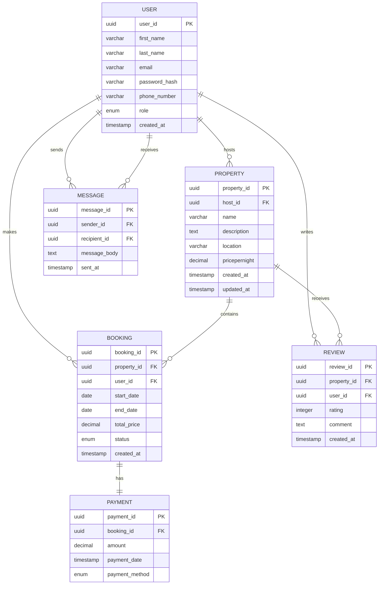

# Airbnb ER Diagram Requirements

## Objective

Entity-Relationship Diagram (ERD) for the core Airbnb system. The ERD represent
entities, attributes, relationships, and constraints described in the database
specification below

---

## Table of Contents

[Airbnb ER Diagram Requirements](#airbnb-er-diagram-requirements)
[Entities and Attributes](#entities-and-attributes)
    - [User](#user)
    - [Property](#property)
    - [Booking](#booking)
    - [Payment](#payment)
    - [Review](#review)
    - [Message](#message)
[Relationships](#relationships)
[Airbnb Clone ER Diagram](#airbnb-clone-er-diagram)
    - [Mermaid ER Diagram](#mermaid-er-diagram)
    - [Lucid Chart ER Diagram](#lucid-chard-er-diagram)
[Constraints Summary](#constraints-summary)

---

## Entities and Attributes

### User

- `user_id` (PK, UUID, Indexed)
- `first_name` (VARCHAR, NOT NULL)
- `last_name` (VARCHAR, NOT NULL)
- `email` (VARCHAR, UNIQUE, NOT NULL)
- `password_hash` (VARCHAR, NOT NULL)
- `phone_number` (VARCHAR, NULL)
- `role` (ENUM: guest, host, admin)
- `created_at` (TIMESTAMP, DEFAULT CURRENT_TIMESTAMP)

### Property

- `property_id` (PK, UUID, Indexed)
- `host_id` (FK → User.user_id)
- `name` (VARCHAR, NOT NULL)
- `description` (TEXT, NOT NULL)
- `location` (VARCHAR, NOT NULL)
- `pricepernight` (DECIMAL, NOT NULL)
- `created_at` (TIMESTAMP)
- `updated_at` (TIMESTAMP)

### Booking

- `booking_id` (PK, UUID, Indexed)
- `property_id` (FK → Property.property_id)
- `user_id` (FK → User.user_id)
- `start_date` (DATE, NOT NULL)
- `end_date` (DATE, NOT NULL)
- `total_price` (DECIMAL, NOT NULL)
- `status` (ENUM: pending, confirmed, canceled)
- `created_at` (TIMESTAMP)

### Payment

- `payment_id` (PK, UUID, Indexed)
- `booking_id` (FK → Booking.booking_id)
- `amount` (DECIMAL, NOT NULL)
- `payment_date` (TIMESTAMP)
- `payment_method` (ENUM: credit_card, paypal, stripe)

### Review

- `review_id` (PK, UUID, Indexed)
- `property_id` (FK → Property.property_id)
- `user_id` (FK → User.user_id)
- `rating` (INT: 1-5)
- `comment` (TEXT, NOT NULL)
- `created_at` (TIMESTAMP)

### Message

- `message_id` (PK, UUID, Indexed)
- `sender_id` (FK → User.user_id)
- `recipient_id` (FK → User.user_id)
- `message_body` (TEXT, NOT NULL)
- `sent_at` (TIMESTAMP)

---

## Relationships

| From     | To       | Type            | Description                        |
| -------- | -------- | --------------- | ---------------------------------- |
| User     | Property | 1:N (host)      | A host can list many properties    |
| User     | Booking  | 1:N             | A guest can make many bookings     |
| Property | Booking  | 1:N             | A property can have many bookings  |
| Booking  | Payment  | 1:1             | Each booking has one payment       |
| User     | Review   | 1:N             | A guest can review many properties |
| Property | Review   | 1:N             | A property can have many reviews   |
| User     | Message  | 1:N (sender)    | A user can send many messages      |
| User     | Message  | 1:N (recipient) | A user can receive many messages   |

---

## Airbnb Clone ER Diagram

### Mermaid ER Diagram

### Lucid Chard ER Diagram

---

## Constraints Summary

`User.email` → UNIQUE

`Review.rating` → CHECK 1 <= rating <= 5

ENUMs for `role`, `status`, `payment_method`

Foreign key constraints across all relational fields

Indexes on all PKs and:

`email` (User)

`property_id` (Property, Booking)

`booking_id` (Booking, Payment)
